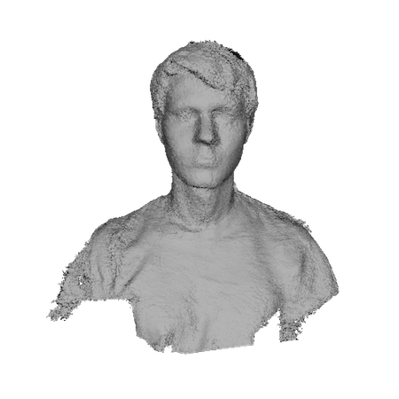

# Brooks's Noggin

I won a raffle prize in [Chris Tralie's](http://www.ctralie.com/) Digital 3D Geometry (CS/MATH 290) course taught at Duke University during Spring 2016. This scan will be used to print a miniature bust of yours truly.

